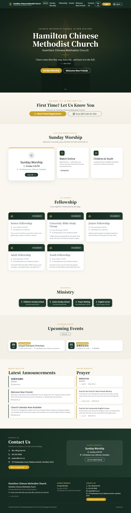
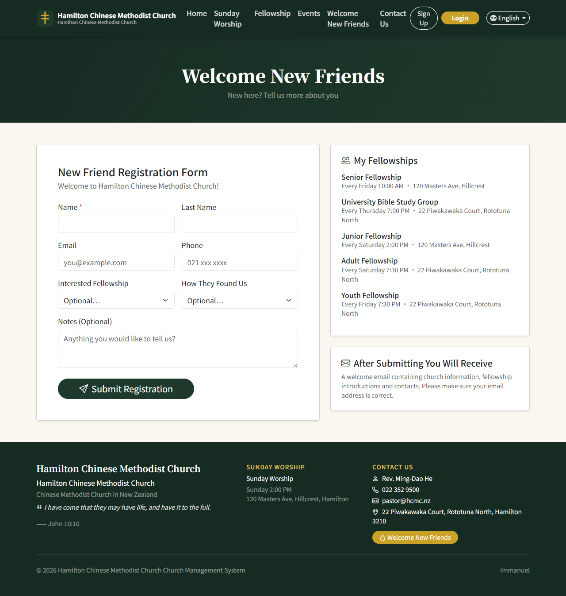
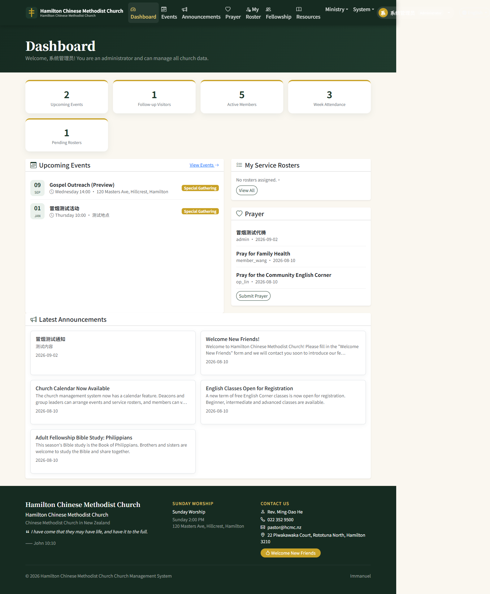
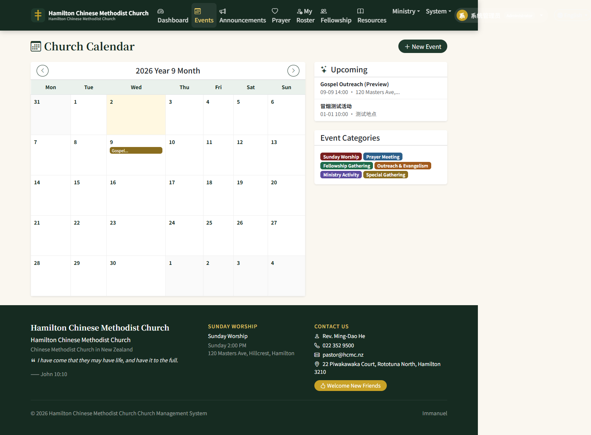
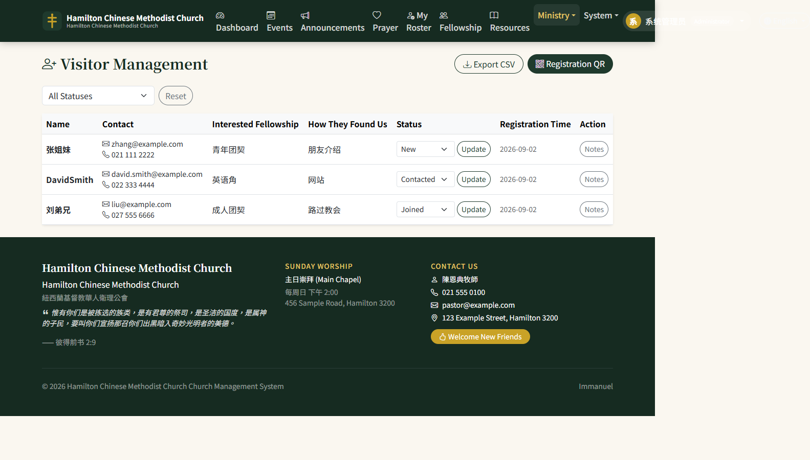
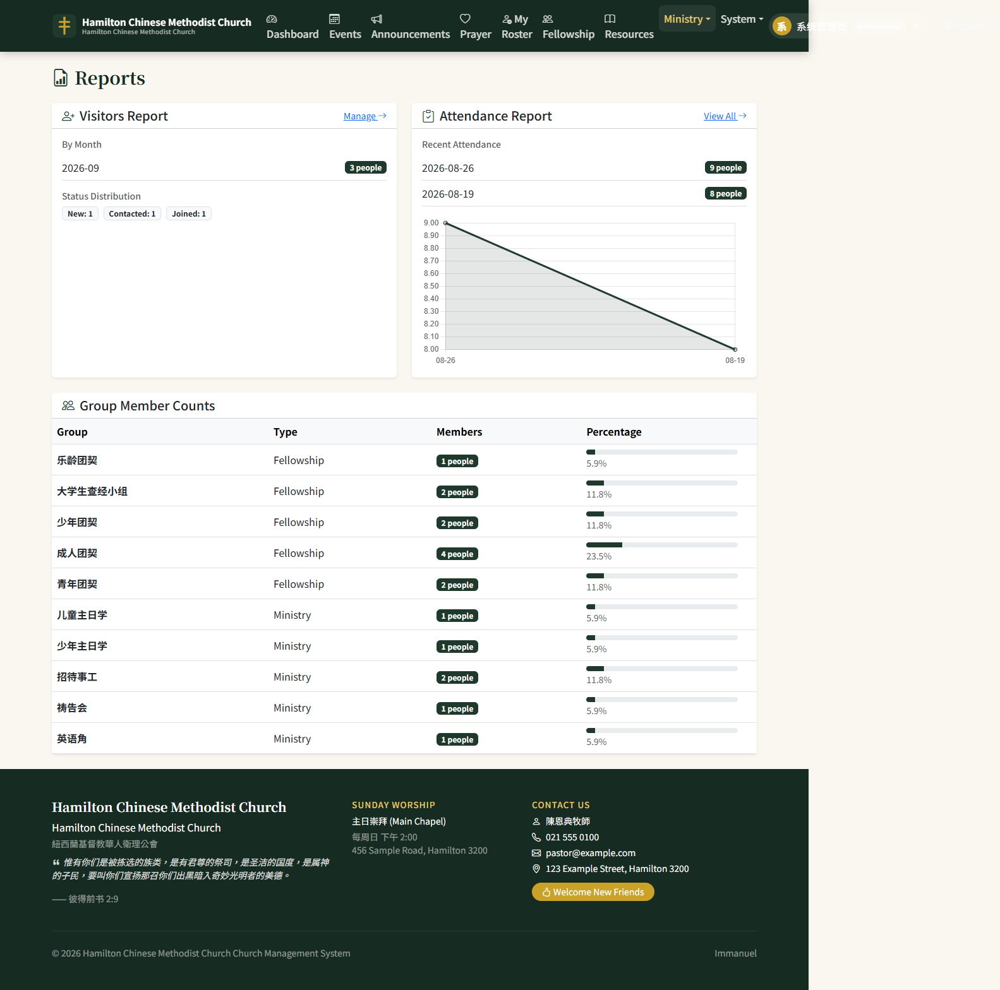

# CCMC_HAM Church Management System


**Hamilton Chinese Methodist Church (漢美頓懷恩堂) Church Management System**

A full-stack church management platform built with **Flask + MySQL**. It covers authentication, role-based access control (RBAC), fellowships, dashboards, announcements, a resource library, plus church-specific features such as a video homepage, calendar, event promotion, visitor registration, prayer requests, attendance records, ministry rosters, and statistical reports.

---

## Highlights

- **Full-stack Flask application** with 14 feature modules organised as Blueprints (auth, dashboard, events, announcements, prayer, visitors, attendance, rosters, fellowships, resources, reports, admin).
- **Custom RBAC** with 4 roles (System Admin / Deacon / Service Staff / Member), enforced server-side by reusable decorators.
- **Bilingual UI** (Traditional Chinese / English) powered by Flask-Babel, with automatic language detection and per-user language persistence.
- **Automated testing**: 26 pytest tests plus a full-page smoke test covering public pages, role permissions, and CRUD flows; both run in **GitHub Actions CI** against a MySQL 8.0 service container.
- **12-factor friendly configuration**: database settings and secrets are read from environment variables, with a gitignored local override file (`connect_local.py`) and a committed example template.
- **Clean, dependency-pinned** `requirements.txt`, MIT-licensed.

---

## Screenshots

Public homepage | Visitor registration | Admin dashboard
:---:|:---:|:---:
 |  | 

Calendar | Visitor management | Statistical reports
:---:|:---:|:---:
 |  | 

> Screenshots can be regenerated with `python scripts/capture_screenshots.py` (requires `playwright` from `requirements-dev.txt`).

---

## Tech Stack

| Layer | Technology |
|---|---|
| Backend | Python 3.13, Flask 3.1 |
| Database | MySQL 8.0, PyMySQL |
| Frontend | Jinja2, Bootstrap 5, Vanilla JS, Chart.js (reports) |
| Authentication | Flask-BCrypt, custom RBAC decorators |
| i18n | Flask-Babel (Traditional Chinese / English) |
| Email | smtplib (visitor welcome emails, configurable SMTP) |
| CI | GitHub Actions (MySQL 8 service + smoke test) |

---

## Features

### Public Portal (no login required)
- **Video homepage**: full-screen video hero (supports MP4 / YouTube links; changeable under "Church Settings" in the admin panel)
- Church info, Sunday services (times and locations of two services), fellowship life, ministry activities
- Upcoming public event calendar, church announcements, public prayer wall
- **Visitor registration**: online form + on-site QR code page; automatically sends a welcome email (including church info, fellowship introductions, and contacts) after registration
- Contact us

### Roles & Permissions (after login)
| Role | Permissions |
|---|---|
| System Admin | Full access: member & role management, church settings, fellowship/ministry management, events, announcements, visitors, attendance, rosters, reports |
| Deacon / Coordinator | Publish and edit events, announcements, and resources; follow up visitors; record attendance and view reports; manage ministry rosters; manage fellowships; update prayer statuses |
| Service Staff | Record attendance, view/confirm their own roster duties, view calendar and announcements, submit prayer requests |
| Member | View calendar/announcements/prayers/resources/fellowships, join fellowships, view their own roster duties, maintain their profile |

### Management Modules
- **Calendar**: month view + event list + event detail; supports categories (Sunday Service / Prayer Meeting / Fellowship / Outreach / Ministry / Special Service)
- **Event Promotion**: publish church announcements and event promotions, grouped by fellowship
- **Prayer Requests**: submit, public/private, status tracking (Pending / In Progress / Answered)
- **Visitor Management**: registration list, status tracking (New / Contacted / Joined), notes, CSV export
- **Attendance Records**: batch entry by date/event (ushers can paste name lists directly), attendance reports
- **Ministry Rosters**: schedule by date/event/ministry team (usher, pianist, scripture reader, sound/AV, etc.); service staff can confirm their duties
- **Fellowships & Ministries**: fellowship info management, member/leader management, join/leave fellowships
- **Resource Library**: publish and search hymns, scriptures, testimonies, and materials
- **Statistical Reports**: visitor statistics by month/status, attendance trend charts, fellowship size distribution
- **System Administration**: member accounts with roles/status, church info / homepage video / SMTP settings

---

## Quick Start

### Requirements
- Python 3.13+
- MySQL 8.0 (local)

### 1. Install Dependencies

```bash
python -m venv .venv
.venv\Scripts\activate        # Windows
pip install -r requirements.txt
```

### 2. Configure MySQL

Copy the example config and fill in your local MySQL username and password:

```bash
copy CCMC_HAM\connect_local.example.py CCMC_HAM\connect_local.py   # Windows
cp CCMC_HAM/connect_local.example.py CCMC_HAM/connect_local.py     # macOS / Linux
```

```python
dbuser = "root"
dbpass = "your password"
dbhost = "127.0.0.1"
dbport = 3306
dbname = "ccmc_ham"
```

> `connect_local.py` is gitignored. Alternatively, set the `DB_USER`, `DB_PASSWORD`, `DB_HOST`, `DB_PORT`, and `DB_NAME` environment variables.

Create the database and import the schema and seed data (skip if already imported):

```bash
mysql -u root -p -e "CREATE DATABASE ccmc_ham CHARACTER SET utf8mb4 COLLATE utf8mb4_unicode_ci;"
mysql -u root -p --default-character-set=utf8mb4 ccmc_ham < sql/ccmc_create_database.sql
mysql -u root -p --default-character-set=utf8mb4 ccmc_ham < sql/ccmc_populate_database.sql
```

Or use the included setup script (reads the same environment variables):

```bash
python scripts/setup_db.py
```

### 3. Run

```bash
flask run          # or python app.py
```

Open http://127.0.0.1:5005

### Demo Accounts (password for all accounts: `Password123!`)

| Username | Role |
|---|---|
| `admin` | System Admin |
| `coord_chen` | Deacon / Coordinator |
| `op_lin` | Service Staff |
| `member_wang` | Member |

---

## Verification

```bash
python -m pytest tests -v             # Unit / integration tests (uses a dedicated ccmc_ham_test database)
python scripts/smoke_test.py          # Smoke test: public pages + role permissions + CRUD flows
```

Data created during the test can be cleaned up with `scripts/cleanup_smoke.sql`, or you can simply re-import the seed data to restore the initial state. The same smoke test runs automatically in GitHub Actions on every push to `main` and on pull requests.

---

## Deployment (Free Tier)

The app is a standard Flask + MySQL application that reads all configuration from
environment variables (`DB_USER`, `DB_PASSWORD`, `DB_HOST`, `DB_PORT`, `DB_NAME`, and
optional `DB_SSL` / `DB_SSL_CA`), so it can be deployed to any container host.

### 1. Database - TiDB Cloud Serverless (free, MySQL-compatible)

1. Sign up at https://tidbcloud.com (GitHub / Google login) and create a **Serverless** cluster.
2. In the cluster console, create a database user (or use the default `root`) and download the **CA certificate**.
3. Note the connection details: host (e.g. `gateway01.ap-southeast-1.prod.aws.tidbcloud.com`), port `4000`, username, and password.

### 2. App - Render (free web service)

1. Sign up at https://render.com using **GitHub** login.
2. **New - Blueprint** - select this repository. Render reads `render.yaml` and creates the service.
3. Only **`DB_PASSWORD`** needs to be entered (either when prompted or in the service's **Environment** tab after creation). All other variables are preconfigured in `render.yaml`, and the TLS CA bundle is baked into the Docker image at `/etc/ssl/certs/tidbcloud-cacert.pem`.

| Variable | Example | Notes |
|---|---|---|
| `DB_HOST` | `gateway01.ap-southeast-1.prod.aws.tidbcloud.com` | TiDB Serverless host |
| `DB_PORT` | `4000` | TiDB Serverless port |
| `DB_NAME` | `ccmc_ham` | Database name |
| `DB_USER` | `root` | Database user |
| `DB_PASSWORD` | `******` | Database password |
| `DB_SSL` | `1` | Enable TLS |
| `DB_SSL_CA` | `/etc/ssl/certs/tidbcloud-cacert.pem` | CA bundle baked into the Docker image (public Mozilla roots) |

### 3. Import schema and seed data

Run the setup script from your machine against the remote database (it reads the same env vars):

```bash
DB_USER=root DB_PASSWORD=your-password DB_HOST=your-host DB_PORT=4000 DB_NAME=ccmc_ham \
DB_SSL=1 DB_SSL_CA=/path/to/ca.pem python scripts/setup_db.py
```

On Windows PowerShell:

```powershell
$env:DB_USER='root'; $env:DB_PASSWORD='your-password'; $env:DB_HOST='your-host'
$env:DB_PORT='4000'; $env:DB_NAME='ccmc_ham'; $env:DB_SSL='1'; $env:DB_SSL_CA='C:\path\to\ca.pem'
python scripts/setup_db.py
```

> On the free Render tier the service sleeps after ~15 minutes of inactivity and wakes on the next visit, so the first load may take 30-60 seconds.

---
## Directory Structure

```
CCMC_HAM/                 # Church management system (main project package)
  auth/                   # Login / registration / profile
  main/                   # Public portal (video homepage, visitor registration, QR code)
  dashboard/              # Role-based dashboards
  events/                 # Calendar
  announcements/          # Event promotion / announcements
  prayer/                 # Prayer requests
  visitors/               # Visitor management
  attendance/             # Attendance records
  rosters/                # Ministry rosters
  fellowships/            # Fellowships & ministries
  resources/              # Hymns / scriptures / testimonies / materials
  reports/                # Statistical reports
  admin/                  # Member permissions & church settings
  shared/                 # RBAC decorators, etc.
  templates/ static/      # Templates and frontend assets
sql/ccmc_*.sql            # Database schema and seed data
scripts/                  # Smoke test, DB setup, and screenshot utilities
docs/screenshots/         # README screenshots
.github/workflows/ci.yml  # GitHub Actions CI
```

---

## License

[MIT](LICENSE)